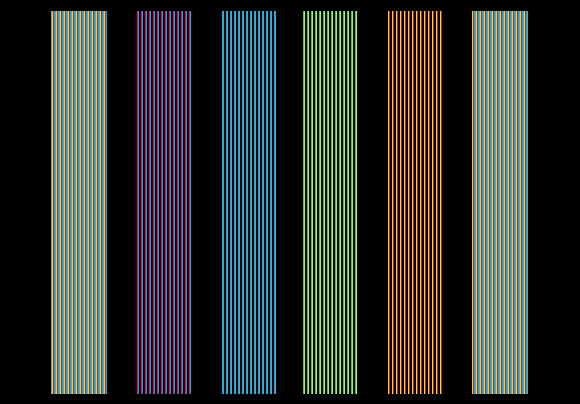

# APPLER

Alexander Patalenski | Emil Dotchevski

# Introduction

Appler is an Apple ][ emulator for IBM PC, written in 8088 assembly, running on MS-DOS. It was developed in 1990, at a time when Apple IIe was still in production, so Appler is one of the first Apple ][ emulators ever made; it is probably also the fastest, although this distinction is no longer important.

This repo contains the executable binaries as well as the complete source code. Distributed under the Boost Software License - Version 1.0.

At the time of this writing, Apple ][ is an antique and MS-DOS is obsolete. However, Appler still runs on [DOSBOX](https://www.dosbox.com/) on Windows or on Mac. So now you can play Apple ][ games running on Appler running on DOSBOX running on MacOS. :)

# Contents
1. [Running Appler](#1-running-appler)
2. [Support](#2-support)
3. [The amazing Apple \]\[](#3-the-amazing-apple)
    - [The humble beginning](#the-humble-beginning)
    - [Hardware](#hardware)
    - [In popular culture](#in-popular-culture)
4. [How Appler works](#4-how-appler-works)
    - [The 6502 emulator](#the-6502-emulator)
    - [Video memory and I/O memory](#video-memory-and-io-memory)
    - [HGR mode emulation](#hgr-mode-emulation)
    - [Task manager](#task-manager)
5. [Emulated hardware](#5-emulated-hardware)
6. [Startup sequence](#6-startup-sequence)
7. [Utilities / navigation](#7-utilities--navigation)
    - [Debugger](#debugger)
    - [File manager](#file-manager)
    - [Disk manager](#disk-manager)
    - [Keyboard setup](#keyboard-setup)
8. [File formats](#8-file-formats)
9. [Building Appler](#9-building-appler)

### Appendix

I. [Appler debugger commands](#i-appler-debugger-commands)\
II. [Bulgarian semiconductor industry in the 1980s](#ii-bulgarian-semiconductor-industry-in-the-1980s)\
III. [The Electric Duet, improved](#iii-the-electric-duet-improved)

# 1. Running Appler

To download Appler, click the green `Code` button in GitHub, and in the drop-down menu select `Download ZIP`. Double-click the downloaded file to unzip it.

Next, download and install DOSBOX from https://www.dosbox.com/. Run DOSBOX, and on its command prompt enter the following commands (replacing `<path-to-appler` with the location where you unzipped Appler):

```
mount c <path-to-appler>
c:
cd bin
appler
```

# 2. Support

Feel free to create GitHub issues, hopefully I can help.

 Appler's startup disk boots the classic Apple ][ game Lode Runner. A lot of Apple ][ software is available for download at:

 * https://mirrors.apple2.org.za/ftp.apple.asimov.net/images/
 * https://apple2online.com/

# 3. The amazing Apple ][

Before talking about Appler, I should introduce the machine it emulates, the amazing Apple ][.

## The humble beginning

Apple Computer started in Steve Wozniak's apartment. Here he is, next to the other, more famous Steve:


Wozniak designed and put together the Apple I, which was sold as a kit, meaning the computer was sold barebones, and had to be assembled by the buyer. This is a nice surviving example, mounted in a briefcase:


Notice the compact cassette player. Back in those days, when you booted up the computer, there was no software loaded on it. You either write the code every time you turn the power on, or else read it from a cassette tape.

Next was the Apple ][, which had a yellowish skin:


Curiously, it supported the Cyrillic alphabet right out of the box.

I'm kidding of course, the above is the Bulgarian-made clone of the Apple ][. If you read the screen, it says `ИМКО   2`. You probably wonder why its name contains 3 spaces, that's because the engineers hacked directly into the binary code of the original ROM, where they simply replaced the 8 bytes that spelled Apple ][.

It is perhaps unfair to introduce the illegal clone before the original American masterpiece, but let me assure you, behind the commie skin the brilliance of Wozniak's design was intact, and it was built like a tank. The entire bottom of the case, on which everything else is bolted on, is a solid 2mm steel plate which doubles as a giant heat sink for 100% silent operation:


I don't know how much one of these cost, because in Communist Bulgaria such things were considered "means of production" and nobody could own one. Instead, they were available for free use at schools and at public computing centers.

> Interesting detail: the original Apple ][+ did not support lowercase letters in text mode. This design shortcomming worked out great for the Bulgarians, because it meant that Western software didn't generally attempt to display lowercase, so that section of the character set could be used to add Cyrillic letters in a backwards-compatible manner; it is as if Wozniak had reserved space for Cyrillic in the original 7-bit character set.

---

## Hardware

Enough about this Commie business. Naturally, the actual Apple ][  looked a lot nicer:


The Apple ][ uses the 6502 CPU, which was designed by a team lead by Chuck Peddle. The team worked for Motorola and proposed an idea for a new, cheaper, faster CPU. The company rejected it, the entire team quit and joined MOS Technology, which produced what became known as the 6502 (the Bulgarians copied that too, making the 100% compatible CM630).

But as great as the 6502 was, at the heart of Apple ][ is Wozniak's brilliant design. He alone designed the hardware as well as the system software.

If one studied the overall system design, it became clear that Wozniak was driven by a simple principle: if there was a way to save 5c in production cost, at the expense of making the life of the programmer 100x more difficult, he'd totally go for it.

As an example, consider the floppy disk controller for Apple ][:


Just kidding. :) The above is the floppy disk controller for the IBM PC/XT. The Wozniak design is below:


If you wonder how can these two cards do the same thing, they really don't. The IBM controller has its own CPU, supports DMA, and does a lot of heavy lifting that makes it easy to write the software. In contrast, the Wozniak design does about 10% of what most reasonable people would consider sufficient for it to be called Disk ][ Interface Card, and yet there it was, and it worked beautifully, although all low level encoding is done in software.

As another example, consider the Apple ][ speaker. Most other computers at least have a simple timer that lets you play a sound with a given frequency. But on the Apple ][, each access of address `$C030` inverts the polarity of the speaker, and that's all of the support you get from the hardware. And yet, Paul Lutus gave us [The Electric Duet](https://arachnoid.com/electric_duet/index.html), which plays two voice music (though it produced an audible 14,080 Hz noise as a side effect of duty cycle modulation; Alex wrote his own player from scratch to fix this, and hacked into the binary code to replace the original player. This improved Electric Duet sounded [like this](images/jukebox.mp3)).

This minimalist approach seems counter-intuitive, but only if difficult to write software is seen as a downside; yet software -- unlike hardware -- is free to distribute. The result was a cheap, powerful and interesting machine.

Besides, programmers love solving complex problems and take pride in exceptionally clever masterpieces. Wozniak himself set an example of what's possible, managing to fit in 12 KB of memory a Basic interpreter, a program editor, and a debugger.

---

## In popular culture

The Hollywood blockbuster The Terminator featured some 6502 code for Apple ][ in several scenes, seen on the Terminator's HUD:


# 4. How Appler works

## The 6502 emulator

Most of the state of the emulated 6502 CPU is stored in 8088 registers:

* `A` => `dl`
* `X` => `cx`
* `Y` => `bp`
* `PC` => `si`

The `Z` and `N` flags are stored directly in the 8088 `ZF` and `SF`, while `dh` stores the `C` and the `O` flags. The stack pointer is stored in memory.

The reason the `PC` register is stored in `si` is that this makes it possible to load the next opcode or 8-bit operand using `lodsb`, and of course 16-bit operands can be loaded via `lodsw`.

All of the CPU emulation code occupies 64KB of contiguous memory, with the emulation routine for each opcode located at the beginning of each 256-byte segment. The `bl` register is kept at zero.

With this arrangement, here is the complete implementation of the 6502 instruction `INX` (increment the `X` register):

```
inc     cl
lodsb
mov     bh, al
jmp     bx
```

Because incrementing `cl` leaves the `ZF` and `SF` in the correct state that matches the semantics of `INX`, there is no more work to do, we simply load and execute the next opcode.

All of these acrobatics are no longer needed, but back when we wrote this code Appler achieved 75% of the speed of a physical Apple ][ (which runs at 1 MHz) on a 4.75 MHz PC/XT.

---

## Video memory and I/O memory

Depending on the selected video mode, writes to some 6502 memory addresses need to be visualized to emulate the Apple ][ video controller. This complicates memory access emulation in general, since each instruction may need to do extra work depending on the (dynamic) address it uses.

This is implemented by individual emulation routines for each 256-byte page of the 6502 address space. These routines share the same instruction space used to implement the 6502 opcodes, occupying the second half of each 256-byte segment (so, the emulation routine for opcode $20 (`JSR`) shares the same segment as the emulation routines for reading and writing at addresses $2000...$20FF.

Both 40x24 text mode and low graphics mode are mapped to the PC 40x25 text mode. High graphics mode (280x192) is emulated at double horizontal resolution. Mixed graphics/text is supported as well.

---

## `HGR` mode emulation


The Apple ][ high resolution graphics mode is commonly referred to as `HGR`, named after the corresponding BASIC command. In that mode, there are 280x192 pixels. The high order bit of each byte of video memory selects between two color palettes, and the rest of the bits control 7 individual pixels:

* If a pixel-controlling bit is clear, the corresponding pixel is off.
* If a pixel-controlling bit is set, the corresponding pixel is on. Depending on the color palette bit:
    * Pixels at even-numbered screen columns are either purple or blue;
    * Pixels at odd-numbered screen columns are either green or orange;
    * If two neighboring pixels are on (even if they're controlled by two different bytes) they become white.

Horizontally, groups of 7 pixels map to sequential bytes in memory, so in order to light up a pixel, the program must divide the desired `X` coordinate by 7 and compute the reminder. Since the horizontal resolution is 280 pixels, the maximum value of the `X` coordinate does not fit in any register (it's an 8-bit CPU). Plus, there is no division instruction. Vertically, sequential horizontal screen lines do not map to sequential memory addresses; this is to save on DRAM refresh circuitry.

There are two blacks and two whites, and to see any other color, every other bit (pixel) must be clear (off). Here are the 6 non-black `HGR` colors, surrounded by the two whites, as rendered by Appler:



But how could a simple video controller from the 1970s implement such complex logic in hardware? How would neighboring pixels know about each other so they can turn white if they're both on? In fact they don't, and it's really simple (after all, it is Wozniak design), but you need to consider half-pixels. Indeed, Appler emulates `HGR` mode at the sub-pixel level, using double the resolution horizontally. Here are the same 6 colors, but in smaller bands and turned at 90 degrees:


And now, the same image zoomed-in, so we can see the individual -- you guessed it -- not pixels, but sub-pixels:


Keep in mind, each vertical color line you see in this last image is half a pixel wide, two neighboring vertical lines making up a single vertical line of Apple ][ pixels. There are only 4 primary colors which are carefully selected so they combine together to produce the 6 perceived `HGR` colors; and there's no complex logic in hardware, if you light up two neighboring pixels, the colors "automatically" combine to produce white.

At the time we wrote Appler we of course knew that the colors are supposed to be purple, blue, green, and orange, but we had never seen them displayed by an actual physical computer, because the Apple ][ displays that were available in Bulgaria were all monochrome-green. Alex looked at the schematics, and he used the actual resistor values of the DAC to calculate what the 4 primary colors should be. The values ended up in a table in the source code (because, sadly, they are not powers of two). So, when we first ran Appler on a color EGA display, it was very satisfying to see that the colors it displayed were indeed purple, blue, green and orange. :)

As with everything else in Appler, the `HGR` emulation is extremely lean and mean, and there is a known issue (not a bug, since it was by design) that never got fixed. The way Alex wrote that code, bytes with the palette bit clear leave a half pixel artifact if cleared with `$80` (black 2), and vice versa. This doesn't seem to happen very often, but it happens a lot in some games. Mario Bros. by Atarisoft is one of them. These artifacts look like this:


Since at this point speed isn't important at all, this can be fixed. Some other day. :)

> (The very first version of Appler ran on a CGA display and it didn't have color. Also, for speed, each byte of video memory controlled 8, rather than 7 CGA pixels. At some point that code got discarded; Appler now requires EGA display).

---

## Task manager

Appler has built-in Debugger, File Manager, Disk Manager, and Keyboard Setup utility. Like the emulation code itself, these utilities are written in 8088 assembly. Everything runs on a custom cooperative multi-tasking system, with a task manager switching between the Apple ][ emulator and the different utilities, without affecting their internal state (this is similar to the way multi-tasking is implemented in early versions of Macintosh OS and Windows).

The debugger is quite handy, I have fond memories of my college roommate Ivo using it to disarm the clever copy protection of an Apple ][ game he wrote all by himself. I recently asked Ivo why did the game have copy protection at all, since I didn't think it was distributed commercially. His answer:

> Well, I wrote a sector editor (author's note: that's a program used to break copy protections), and then I thought hm, I should come up with an awesome unbreakable copy protection, and then I thought OK, I should write a game that I can copy-protect, and this is how Space Warrior (Космически боец) was created. There were in fact many layers of the copy protection: using invalid 6502 instructions to throw off boot tracers;  non-standard 6&2 encoding system fields; sectors that were physically destroyed with a razor (the game checking that a specific area of the disk could not be read); half of each track written at a half-track offset (since the floppy disk motor could move the head at smaller than a single track increments) -- to name a few.

# 5. Emulated hardware

Appler emulates:

* The valid instructions of the 65C02 CPU
* Memory: 48K RAM, 12K ROM, 16K additional RAM
* I/O Memory:
    * $C000, $C010 - keyboard
    * $C020 - sound output (using DAC on LPT1)
    * $C030 - internal speaker
    * $C050..$C057 - video mode switches
    * $C060, $C070 - joystick buttons & timers
    * $C080..$C08F - additional RAM switches
    * $C0E0..$C0EF - floppy disk controller registers (on slot #6)
* Video modes (even mixed GR/TEXT modes)
* Keyboard
* Digital joystick (using arrow keys in Num Lock mode)
* Floppy Disk Controller and two Floppy Disk Drives

Here is the output from an Apple ][ hardware detection program written in 2021 by Marc A. Golombeck, running on Appler:


# 6. Startup sequence

The `bin` directory contains the pre-build binary `APPLER.EXE`. On DOSBOX, you can `cd` into the `bin` directory and just type `appler` to run Appler.

In addition, the `bin` directory contains:

* `APPLE.ROM`: The 12 KB ROM from Правец-82. This is the Bulgarian-made clone of Apple ][, though we replaced the commie text `ПРАВЕЦ` with the original `Apple ][`. I think the rest of it was a pristine copy of the original ROM, but I don't know that for a fact.
* `FLOPPY.ROM`: 256-bytes of pure Steve Wozniak genius, the Apple DOS bootstrap code, originally stored on the floppy disk controller. This was mapped at address $C600..$C6FF when the controller is inserted in slot 6 (by convention).
* `MONITOR.LAB`: A file that can be loaded in the Appler Debugger, to show the symbolic names of the standard Apple routines from `APPLE.ROM`.
* `APPLER.DSK`: A custom demo for Appler written in 6502 assembly by Ivo Beltchev, plus the Apple ][ classic Lode Runner.

At startup, Appler loads all `.ROM` files from its startup directory into memory. Usually, this is the two files `APPLE.ROM` and `FLOPPY.ROM`. If found, it will also "insert" `APPLER.DSK` into Drive 1.

Next it executes the standard Apple ][ boot sequence. In the default configuration of the `bin` directory, this will boot `APPLER.DSK`, which will first play Ivo's demo, then `BRUN LR2+2` to execute Lode Runner. If you want to interrupt this sequence, as soon as you see the title `Apple ][`, hit `Ctrl+C` and wait. Once DOS loads, you'll hear a beep and you'll get the Apple Basic command prompt.


> Note: `APPLER.DSK` is formatted with Eagle Software GraphExt DOS. This is a Bulgarian operating system, written by (I think) Orlin Shopov. It is compatible with DOS 3.3, but supports a few extra commmands: `TYPE`, `MAKE`, `BOOT`, `MODE`, `SOUND`, `GLOAD`, `GSAVE`; the last two work with a special file type `G`, which is used to save compressed HGR image files:


# 7. Utilities / navigation

Use the functional keys to access various Appler utilities:

* `F1` toggles the built-in Debugger
* `F2` toggles File Manager, which lets you browse for and load `.APL` and `.ROM` files.
* `F3` toggles Disk Manager, which lets you browse for and load `.DSK` and `.NBL` files into either one of the two emulated disk drives.
* `F4` toggles a simple Keyboard Setup utility.
* `F9` toggles the About screen.
* `F10` toggles the Help screen.

* `Alt+Esc` runs the DOS shell. Type `exit` to return to Appler.
* `Alt+X` quits.

While in one of the utilities, to switch to another utility without returning to the emulated Apple ][, hold `Alt` and press the corresponding functional key.

---

## Debugger

The Appler Debugger visual design is inspired by AFD, a PC debugger developed by AdTec GmbH.


The disassembler is able to scroll forward (towards increasing addresses) as well as back; the latter is tricky because figuring out the start addresses of prior instructions is ambiguous. It is also possible to define labels for known routines, so that they can be easily identified in the disassembled program. There is a built-in 6502 assembler as well.

For a description of all commands supported on the command line in Debugger, see the Debugger commands section.

---

## File manager

Many Apple ][ games are stored as a single DOS 3.3 binary (`B`) file. File Manager can be used to extract them and save them on the PC file system, so they can be started without requiring to boot up the Apple DOS 3.3.

To create an `.APL` file, first you need to load it in memory using `BLOAD` in Apple DOS 3.3 (which does support file names with spaces):

```
BLOAD MARIO BROS.
```

DOS 3.3 saves the address of the loaded binary file in the two bytes at `$AA72` and `$AA73`, and its length in the two bytes at `$AA60` and `$AA61`. We can use the built-in Monitor program to look them up. To enter Monitor, type:

```
CALL -151
```

The prompt will change from `]` to `*`. In Monitor, to read memory we just type an address. So, type `AA72` and hit `Enter` twice. Next, type `AA60` and hit `Enter` twice. Your screen should look like this:


This means that the most recently loaded binary file (`MARIO BROS.`) is at address `$0803`, and its length is `$7F4C` (to exit the Monitor program, press `Ctrl+C`, `Enter`).

Now, hit `F2` to activate File Manager, and press `Alt+M` to highlight the `Memory` window. Select `<New File>` and give it a name (e.g. `MARIO.APL`). Enter the start address (e.g. `0803`) and the end address (e.g. `874E`, which is `0803+7F4C-1`). Press Enter, and Appler will save the file. Your screen should look like this:


Next time you run Appler, you can simply highlight an `.APL` file in the `Directory` window in File Manager and hit `F1` to run it.

File Manager is also able to save the complete Apple ][ state in a file. To do this, when you make a new file in the `Memory` window, select `status` for `Type`.

---

## Disk manager


The most basic use of Disk Manager is to select a `.DSK` file in the `Directory` window, then hit `F1` to insert it into `Drive 1` and boot it. If you press `Enter` instead, the selected disk is inserted in the highlighted drive (use `Alt+1`/`Alt+2` to highlight a drive).

To create a new `.DSK` file, select `<New Disk>` and give it a name. This is now an empty `.DSK` file, which must be formatted before it is used. If you have already booted DOS 3.3, you can use the following commands:

```
NEW
INIT HELLO
```

This will format the disk and make it bootable.

With `.DSK` files, Appler assumes 6&2 encoding, which is used by most, but not all Apple ][ programs. When a program writes data, Appler attempts to decode the raw bytes, which will fail if the program uses a different encoding (for example, DOS 3.2 uses 5&3 encoding). In this case Disk Manager is summoned, requesting user input. It is possible that the program uses 6&2 encoding, but with non-standard values for various components of the sector image; in that case you can change the values in the `DOS 3.3 Sector Image` window, to help Appler decode (and encode) the data correctly.

If the Apple ][ program uses a completely different encoding, you can use `.NBL` instead of `.DSK` disk images. In this case Appler will not attempt to decode the raw bytes, and will not encode them on read operations. `.NBL` files are bigger than `.DSK` files, but they enable you to run DOS 3.2 or other non-standard programs.

---

## Keyboard setup


The primary use of the Keyboard Setup utility is to assign ASCII codes (the Apple ][ keyboard does not use scancodes) to your keys.

Most Apple ][ games support joystick input. Appler emulates a digital joystick; its inputs can also be assigned to any key. Simply select one of the following non-ASCII codes (hex):

* `80` button 0
* `81` button 1
* `82` left
* `83` right
* `84` up
* `85` down

By default, the joystick inputs are assigned to the numeric keypad keys (when Num Lock is on).

# 8. File formats

### `.DSK`

A `.DSK` disk image simply stores raw bytes, 256 bytes per sector, 16 sectors per track, and up to 255 tracks (of course physical 5 1/4 floppies were limited to 35 tracks).

Alex and I came up with the `.DSK` extension as well as the actual file format on our own. Since Appler is one of the very first Apple ][ emulators, it is possible that others adopted what was already an established format. It is also possible that it is a coincidence that all other emulators support this format, since both the format itself as well as the `.DSK` extension "just make sense".

Whatever the reason, there is a LOT of Apple ][ software available for download as `.DSK` files. Use Google, or try these links:

 * https://mirrors.apple2.org.za/ftp.apple.asimov.net/images/
 * https://apple2online.com/

### `.NBL`

This is a low lever disk format which does not presume 6&2 encoding. `.NBL` disks support non-standard I/O, for example you could "format" them with DOS 3.2 (which uses 5&3 encoding).

### `.APL`

These files contain Apple ][ binaries, e.g. games that consist of a single file rather than an entire disk image. The first two bytes specify the address at which the program is to be loaded, the second two bytes specify the number of bytes to load from the rest of the file. This mimics DOS 3.3 binary (`B`) files.

### `.ROM`

This format is identical to `.APL`, except `.ROM` files are auto-loaded at startup.

# 9. Building Appler

I've created a [GitHub repo](https://github.com/zajo/TASM) that contains a TASM installation that can be used with [DOSBOX](https://www.dosbox.com/) to build Appler.

In DOSBOX, you need to mount both the TASM repo and the Appler repo as logical drives, then set the system path so that the TASM build tools are accessible from anywhere:

```
mount a <PATH-TO-APPLER-REPO>
mount t <PATH-TO-TASM-REPO>
PATH=%PATH%;T:\BIN
```

Next, to build Appler, simply `cd` into the `SRC` directory and run `make`:

```
a:
cd SRC
make
```

This will produce `APPLER.EXE` in the current directory.

> IMPORTANT: the Appler source files are stored in DOS (CP437) format, which is NOT compatible with UTF-8. A modern text editor may corrupt them on load or on save.

# Appendix

## I. Appler debugger commands

At any point you can hit F1 to pause the current execution and enter the Appler Debugger. It features a command line that supports the following commands:

reg
* Format: `<reg> = <value>`
* Example: `pc = fbdd`
* Action: Changes a 65C02 register value.

regs
* Format: `regs`
* Example: `regs`
* Action: Enters the 65C02 registers editor (you can use <Alt+R> instead).

asm
* Format: `asm [<addr>]`
* Example: `asm @768`
* Action: Enters Assembler mode. If the address is missing, Debugger uses the address of the current (highlighted) instruction (you can use <Alt+P> instead).

ea
* Format: `ea [<addr>]`
* Example: `ea 300`
* Action: Enters Memory Dump A editor. If the address is missing, Debugger uses the address of the current dump location (you can use <Alt+M> instead).

eb
* Format: `eb [<addr>]`
* Example: `eb 300`
* Action: Enters Memory Dump B editor. If the address is missing, Debugger assumes address of the current dump location (you can use <Alt+M> instead).

d
* Format: `d <addr>`
* Example: `d 300`
* Action: Changes the disassembler address. Use the arrow keys to browse the disassembled program.

da
* Format: `da <addr>`
* Example: `da 300`
* Action: Changes the Memory Dump A address.

db
* Format: `db <addr>`
* Example: `db 300`
* Action: Changes the Memory Dump B address.

[]
* Format: `[<addr1>,<addr2>]`
* Example: `[ 300,3FF ]`
* Action: Specifies the memory block for `copy`, `compare` and `find`.

find
* Format: `find [<byte>[,<byte>]]['str']["str"]`
* Example: `find fa,"ESD",@65,'Alex'`
* Action: Searches a string in the specified memory block. Enter strings and/or bytes to find. If any parameter is missing (e.g. you've entered simply 'FIND'), Debugger repeats the last search.

copy
* Format: `copy <addr>[,f][,b]`
* Example: `copy 2000`
* Action: Copies the specified memory block to `addr`. Optionally, use the `f` or `b` parameter to specify the copying direction (Forward or Backward).

compare
* Format: `compare <addr>`
* Example: `compare 4000`
* Action: Compares the specified memory block to the block at address `addr`. If the blocks are not identical, Memory Dump A shows the first different byte.

pdump
* Format: `pdump [<filename>]`
* Example: `pdump esd.txt`
* Action: Prints a memory dump on the printer (if no filename is given) or in the specified file.

pasm
* Format: `pasm [<filename>]`
* Example: `pasm esd.txt`
* Action: Prints the disassembled program on the printer (if no filename is given) or in the specified file.

break
* Format: `break<num> [= <addr>]`
* Example: `break1 = @768`
* Action: Sets the breakpoint number `num` at address `addr`. Omit the address to simply toggle the breakpoint on and off.

go
* Format: `go [<start>][,<stop>]`
* Example: `go 300,32B`
* Action: Starts the program at address `start` with optional breakpoint at address `stop`.

.
* Format: . `<identifier> = <value>`
* Example: . `Lives = 468A`
* Action: Assigns value to a label. From now on, the disassembler will match the address operands of various instructions and substitute labels for addresses.

list
* Format: `list`
* Example: `list`
* Action: Shows all of the defined defined labels.

dl
* Format: `dl <identifier>`
* Example: `dl Lives`
* Action: Deletes a label.

labels
* Format: `labels on|off`
* Example: `labels off`
* Action: Turns labels on or off.

sl
* Format: `sl <filename>`
* Example: `sl monitor`
* Action: Save defined labels in file `filename`. If the extension is missing, Debugger assumes '.LAB'.

ll
* Format: `ll <filename>`
* Example: `ll monitor`
* Action: Loads labels from file `filename`.

record
* Format: `record [,f]`
* Example: `record`
* Action: Starts recording keystrokes. In this mode Appler stores all the keys you press in a buffer. Use ',f' parameter to ignore delays between the keystrokes.

stop
* Format: `stop`
* Example: `stop`
* Action: Stops recording keystrokes.

play
* Format: `play [<filename>]`
* Example: `play karateka`
* Action: Plays keystrokes in the buffer or from the specified file.

lm
* Format: `lm <filename>`
* Example: `lm mario`
* Action: Loads keystrokes from the specified file.

sm
* Format: `sm <filename>`
* Example: `sm mario`
* Action: Saves keystrokes in the specified file.

swap
* Format: `swap <timer_ticks>`
* Example: `swap @18`
* Action: Sets the delay for screen swapping when tracing statements. When Debugger resumes program execution, it delays switching to the emulated display in case the debugger is activated again (e.g. by a breakpoint).

sound
* Format: `sound on|off`
* Example: `sound off`
* Action: Turns Apple ][ sound on and off.

reset
* Format: `reset`
* Example: `reset`
* Action: Cold RESET of the Apple ][.

?
* Format: `? <expression>[,b][,d]`
* Example: `? 2+@58-%1001100/2*y,b`
* Action: Evaluates an expression. Use `b` or `d` to specify the result type - binary or decimal (hexadecimal by default).

When entering addresses or numbers, you can use simple mathematical expressions instead. The following operations are available: `+`, `-`, `*`, `/`, `|` (bitwise or), `&` (bitwise and), `^` (bitwise xor), `<` (shift left), `>` (shift right). There is no operator precedence and brackets are not supported -- the expression is evaluated from left to right. As usual, number entry is hexadecimal by default, the `@` prefix indicates decimal numbers, and the `%` prefix indicates binary.

---

## II. Bulgarian semiconductor industry in the 1980s

As mentioned earlier, in 1980s Bulgarian-made Apple ][ clones were available for free use across the country, in open computer centers that were operated by several different government organizations, all in one way or another connected to the Ministry of Education. In practice, the primary use of these computer centers was as free video game arcades, although there was a policy that any other use of the computers takes precedence. This was indeed a great way to get kids into learning to program.


The reason why Bulgaria had developed semiconductor manufacturing is that in the Warsaw pact there was specialization of sorts for each member country, and Bulgaria was one of the members that specialized in personal computers. There were several brands, the most prominent one was Pravetz (Правец), named after the birth place of the Commpnist Party leader. The factory and the research facilities were located in Pravetz as well.

Besides the Apple ][ clone, the Pravetz factory produced IBM PC/XT clones, as well as a clone of the French Oric Atmos home computer under the name Pravetz-8D, pictured below with instruction manual in Russian -- indeed, the Soviet Union was a primary export market:


There were several series of books as well, primarily by Bulgarian authors. The most popular one was "Microcomputer technology for everyone" (Микрокомпютърна техника за всички):


The youth wing of the Communist Party (the Comsomol) published a monthly magazine called Computer for You (Компютър за вас). It contained all sorts of software-related articles and educational material:


Here is a page from the 8/7/1990 issue featuring Alex at line 4 and yours truly at line 37 in a list of the readers who solved a problem posed in the previous issue:


(The problem was to write a 6502 program that divides a number between 0 and 279 by 7, computing the reminder as well, that fits in 50 bytes and takes no more than 71 cycles to run. My solution was 23 bytes and took no more than 71 cycles. Alex had provided two solutions, both fitting the requirements: one that optimizes for size (22 bytes) and the other for speed, which I remember had no loops but I forget the details.)

---


## III. The Electric Duet, improved

This section preserves a bit of Alex's genius for which I don't have a better place to store.

The Electric Duet is a music program for Apple ][ written by Paul Lutus, that plays music in two voices. It featured The Electronic Jukebox:


This was a mind blowing achievement. However, the original player program made an audible (if soft) high pitch noise, which was more or less noticeable depending on the music being played. My copy of the Electric Duet was patched with a player written by Alex, which had no audible artifacts.

Paul Lutus has published the original player [here](https://arachnoid.com/electric_duet/index.html). The listing below shows his program next to Alex's version:

```
Original (Paul Lutus)            Alex Patalenski
-------------------------        -------------------------
0803:   A901   LDA #01           2800:   A900   LDA #00
0805:   8509   STA 09            2802:   85D8   STA D8
0807:   851D   STA 1D            2804:   85D6   STA D6
0809:   48     PHA               2806:   85D7   STA D7
080A:   48     PHA               2808:   A000   LDY #00
080B:   48     PHA               280A:   B11E   LDA (1E),Y
080C:   D015   BNE 0823          280C:   D001   BNE 280F
080E:   C8     INY               280E:   60     RTS
080F:   B11E   LDA (1E),Y        280F:   85D2   STA D2
0811:   8509   STA 09            2811:   AD00C0 LDA C000
0813:   C8     INY               2814:   30F8   BMI 280E
0814:   B11E   LDA (1E),Y        2816:   A200   LDX #00
0816:   851D   STA 1D            2818:   20B328 JSR 28B3
0818:   A51E   LDA 1E            281B:   8D4C28 STA 284C
081A:   18     CLC               281E:   8D5C28 STA 285C
081B:   6903   ADC #03           2821:   8E4F28 STX 284F
081D:   851E   STA 1E            2824:   8E5F28 STX 285F
081F:   9002   BCC 0823          2827:   A201   LDX #01
0821:   E61F   INC 1F            2829:   20B328 JSR 28B3
0823:   A000   LDY #00           282C:   8D7628 STA 2876
0825:   B11E   LDA (1E),Y        282F:   8D8628 STA 2886
0827:   C901   CMP #01           2832:   8E7928 STX 2879
0829:   F0E3   BEQ 080E          2835:   8E8928 STX 2889
082B:   B00D   BCS 083A          2838:   A900   LDA #00
082D:   68     PLA               283A:   A28A   LDX #8A
082E:   68     PLA               283C:   A040   LDY #40
082F:   68     PLA               283E:   85D3   STA D3
0830:   A249   LDX #49           2840:   85D8   STA D8
0832:   C8     INY               2842:   88     DEY
0833:   B11E   LDA (1E),Y        2843:   D00E   BNE 2853
0835:   D002   BNE 0839          2845:   A4D4   LDY D4
0837:   A2C9   LDX #C9           2847:   24D8   BIT D8
0839:   60     RTS               2849:   3019   BMI 2864
083A:   8508   STA 08            284B:   2C30C0 BIT C030
083C:   203008 JSR 0830          284E:   49A0   EOR #A0
083F:   8E8608 STX 0886          2850:   4C6828 JMP 2868
0842:   8506   STA 06            2853:   C4D6   CPY D6
0844:   A609   LDX 09            2855:   D00C   BNE 2863
0846:   4A     LSR               2857:   24D8   BIT D8
0847:   CA     DEX               2859:   100A   BPL 2865
0848:   D0FC   BNE 0846          285B:   2C30C0 BIT C030
084A:   8D7F08 STA 087F          285E:   49A0   EOR #A0
084D:   203008 JSR 0830          2860:   4C6928 JMP 2869
0850:   8EBE08 STX 08BE          2863:   EA     NOP
0853:   8507   STA 07            2864:   EA     NOP
0855:   A61D   LDX 1D            2865:   EA     NOP
0857:   4A     LSR               2866:   EA     NOP
0858:   CA     DEX               2867:   EA     NOP
0859:   D0FC   BNE 0857          2868:   EA     NOP
085B:   8DB708 STA 08B7          2869:   EA     NOP
085E:   68     PLA               286A:   85D8   STA D8
085F:   A8     TAY               286C:   CA     DEX
0860:   68     PLA               286D:   D00E   BNE 287D
0861:   AA     TAX               286F:   A6D5   LDX D5
0862:   68     PLA               2871:   24D8   BIT D8
0863:   D003   BNE 0868          2873:   3019   BMI 288E
0865:   2C30C0 BIT C030          2875:   2C30C0 BIT C030
0868:   C900   CMP #00           2878:   49A0   EOR #A0
086A:   3003   BMI 086F          287A:   4C9228 JMP 2892
086C:   EA     NOP               287D:   E4D7   CPX D7
086D:   1003   BPL 0872          287F:   D00C   BNE 288D
086F:   2C30C0 BIT C030          2881:   24D8   BIT D8
0872:   854E   STA 4E            2883:   100A   BPL 288F
0874:   2C00C0 BIT C000          2885:   2C30C0 BIT C030
0877:   30C0   BMI 0839          2888:   49A0   EOR #A0
0879:   88     DEY               288A:   4C9328 JMP 2893
087A:   D002   BNE 087E          288D:   EA     NOP
087C:   F006   BEQ 0884          288E:   EA     NOP
087E:   C000   CPY #00           288F:   EA     NOP
0880:   F004   BEQ 0886          2890:   EA     NOP
0882:   D004   BNE 0888          2891:   EA     NOP
0884:   A406   LDY 06            2892:   EA     NOP
0886:   4940   EOR #40           2893:   EA     NOP
0888:   244E   BIT 4E            2894:   C6D3   DEC D3
088A:   5007   BVC 0893          2896:   D007   BNE 289F
088C:   7000   BVS 088E          2898:   C6D2   DEC D2
088E:   1009   BPL 0899          289A:   F009   BEQ 28A5
0890:   EA     NOP               289C:   4C4028 JMP 2840
0891:   3009   BMI 089C          289F:   EA     NOP
0893:   EA     NOP               28A0:   EA     NOP
0894:   3003   BMI 0899          28A1:   EA     NOP
0896:   EA     NOP               28A2:   4C4028 JMP 2840
0897:   1003   BPL 089C          28A5:   A51E   LDA 1E
0899:   CD30C0 CMP C030          28A7:   18     CLC
089C:   C64F   DEC 4F            28A8:   6903   ADC #03
089E:   D011   BNE 08B1          28AA:   851E   STA 1E
08A0:   C608   DEC 08            28AC:   9002   BCC 28B0
08A2:   D00D   BNE 08B1          28AE:   E61F   INC 1F
08A4:   5003   BVC 08A9          28B0:   4C0828 JMP 2808
08A6:   2C30C0 BIT C030          28B3:   C8     INY
08A9:   48     PHA               28B4:   B11E   LDA (1E),Y
08AA:   8A     TXA               28B6:   08     PHP
08AB:   48     PHA               28B7:   95D4   STA D4,X
08AC:   98     TYA               28B9:   C905   CMP #05
08AD:   48     PHA               28BB:   9002   BCC 28BF
08AE:   4C1808 JMP 0818          28BD:   4A     LSR
08B1:   CA     DEX               28BE:   4A     LSR
08B2:   D002   BNE 08B6          28BF:   4A     LSR
08B4:   F006   BEQ 08BC          28C0:   4A     LSR
08B6:   E000   CPX #00           28C1:   95D6   STA D6,X
08B8:   F004   BEQ 08BE          28C3:   28     PLP
08BA:   D004   BNE 08C0          28C4:   F004   BEQ 28CA
08BC:   A607   LDX 07            28C6:   A930   LDA #30
08BE:   4980   EOR #80           28C8:   A2A0   LDX #A0
08C0:   70A3   BVS 0865          28CA:   60     RTS
08C2:   EA     NOP
08C3:   50A3   BVC 0868
```

> On the Apple ][, accessing address `$C030` flips the membrane of the speaker. That is all of the sound support we get from the hardware. To play music in two voices, these players access `$C030` at extremely precisely timed intervals. The timing is done based on knowledge of exactly how long each instruction takes to execute (the 6502 runs at 1 MHz). Alex's player sounds [like this](images/jukebox.mp3).

Recently I discovered a different version of Alex's player in an Apple ][ game I had written. I don't know which of the two versions is an improvement on the other, they both sound the same to me. Here's the byte code:

```
6650: A9 01 85 42 85 43 85 44  85 45 A0 00 B1 1E D0 01
6660: 60 C9 01 D0 0D C8 B1 1E  85 42 C8 B1 1E 85 43 4C
6670: FF 66 85 40 C8 B1 1E 85  3C A6 42 4A CA D0 FC 85
6680: 3E C8 B1 1E 85 3D A6 43  4A CA D0 FC 85 3F A6 3C
6690: A4 3D A9 00 24 44 70 0B  30 29 24 45 30 0B EA 10
66A0: 0B 30 09 10 1F 24 45 30  F8 2C 30 C0 85 45 CA F0
66B0: 08 E4 3E F0 08 EA 4C C0  66 A6 3C F0 F9 EA 49 80
66C0: 4C 0E 67 24 EA 2C 30 C0  CA F0 08 E4 3E F0 08 EA
66D0: 4C DA 66 A6 3C F0 F9 EA  49 80 2C 30 C0 88 F0 08
66E0: C4 3F F0 08 EA 4C EF 66  A4 3D F0 F9 EA 49 40 2C
66F0: 30 C0 85 44 C6 41 8D 30  C0 D0 99 C6 40 D0 95 A5
6700: 1E 18 69 03 85 1E 90 02  E6 1F 4C 5A 66 60 88 F0
6710: 08 C4 3F F0 08 EA 4C 20  67 A4 3D F0 F9 EA 49 40
6720: 85 44 4C 26 67 60 C6 41  4C F9 66
```

All three players are compatible, they work with the same music files and use the same interface, taking the address of the music data in $1E and $1F.

---


