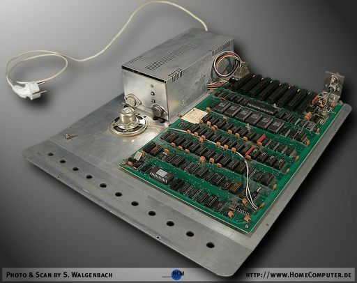

# APPLER

Alexander Patalenski  / Emil Dotchevski

# Introduction

Appler is an Apple ][ emulator running on MS-DOS for IBM PC. It was developed in the 1990s, written in 8086 assembly. This distribution contains the executable binaries as well as the complete source code.

At the time of this writing, Apple ][ is an antique and MS-DOS is obsolete. However, Appler still runs on [DOSBOX](https://www.dosbox.com/) on Windows or on Mac. So now you can play Apple ][ games running on Appler running on DOSBOX running on MacOS. :)

# Support

Feel free to create GitHub issues, hopefully I can help.

 Appler's startup disk boots the classic Apple ][ game Lode Runner. A lot of Apple ][ software is available for download at:

 * https://mirrors.apple2.org.za/ftp.apple.asimov.net/images/
 * https://apple2online.com/

# The Apple ][

Before talking about Appler, I should introduce the machine it emulates, the amazing Apple ][.

## The humble beginnings

Apple Computer started in Steve Wozniak's garage. He designed and put together the Apple I, which was sold as a kit, meaning the computer was sold barebones, and had to be assembled by the buyer. This is a nice surviving example, mounted in a briefcase:


Notice the compact cassette player. Back in those days, when you booted up the computer, there was no software loaded on it. You either write the code every time you turn the power on, or else read it from a casette tape.

Next was the Apple ][, which had a yellow-ish skin:


Curiously, it supported the Cyrillic alphabet right out of the box.

I'm kidding of course, the above is the Bulgarian-made clone of the Apple ][. If you read the screen, it says `ИМКО   2`. You probably wonder why its name contains 3 spaces, that's because the engineers hacked directly into the binary code of the original ROM, where they simply replaced the 8 bytes that spelled Apple ][.

It is perhaps unfair to introduce the illegal clone before the original American masterpiece, but let me assure you, behind the commie skin the brilliance of Wozniak's design was intact, and it was built like a tank. The entire bottom of the case, on which everything else is bolted on, is a solid 2mm steel plate which doubles as a giant heat sink for 100% silent operation:



I don't know how much one of these cost, because in Communist Bulgaria such things were considered "means of production" and nobody could own one. Instead, they were available for free use at schools and at public computing centers.

But enough about this Commie business. Naturally, the actual Apple ][  looked a lot nicer:


The Apple ][ uses the 6502 CPU, which was designed by a team lead by Chuck Peddle. The team worked for Motorolla and proposed an idea for a new, cheaper, faster CPU. The company rejected it, the entire team quit and joined MOS Technology, which produced what became known as the 6502 (the Bulgarians copied that too, making the 100% compatible CM630).

But as great as the 6502 was, at the heart of Apple ][ is Wozniak's brilliant design. He alone designed the hardware as well as the system software.

If one studied the overal system design, it became clear that Wozniak was driven by a simple principle: if there was a way to save 5c in production cost, at the expense of making the life of the programmer 100x more difficult, he'd totally go for it.

As an example, consider the floppy disk controller for Apple ][:


Just kidding. :) The above is the floppy disk controller for the IBM PC/XT. The Wozniak design is below (not to scale):


If you wonder how can these two cards do the same thing, they really don't. The IBM controller has its own CPU, supports DMA, and does a lot of heavy lifting that makes it easy to write the software. In contrast, the Wozniak design does about 10% of what most reasonable people would consider sufficient for it to be called Disk ][ Interface Card, and yet there it was, and it worked beautifully.

This approach seems counter-intuitive, but only if difficult to write software is seen as a downside; yet software -- unlike hardware -- is free to distribute. The result was a cheap, powerful and interesting machine.

Besides, programmers love solving complex problems and take pride in exceptionally clever masterpieces. Wozniak himself set an example of what's possible, managing to fit in 12 KB of memory a Basic interpreter, a program editor, and a debugger (later, Apple licensed from Microsoft a better Basic interpreter that supported floating point math; it was called `APPLESOFT BASIC`, a name derived from the names of both Apple and Microsoft).

## In popular culture

The Holywood blockbuster The Terminator featured some 6502 code for Apple ][ in several scenes, seen on the Terminator's HUD:


# How Appler Works

## The 6502 Emulator

Most of the state of the emulated 6502 CPU is stored in 8086 registers:

* `A` => `dl`
* `X` => `cx`
* `Y` => `bp`
* `PC` => `si`

The `Z` and `N` flags are stored directly in the 8086 `ZF` and `SF`, while `dh` stores the `C` and the `O` flags. The stack pointer is stored in memory.

The reason the `PC` register is stored in `si` is that this makes it possible to load the next opcode or 8-bit operand using `lodsb`, and of course 16-bit operands can be loaded via `lodsw`.

All of the CPU emulation code occupies 64KB of contiguous memory, with the emulation routine for each opcode located at the beginning of each 256-byte segment. The `bl` register is kept at zero.

With this arrangement, here is the complete implementation of the 6502 instruction `INX` (increment the `X` register):

```
inc     cl
lodsb
mov     bh, al
jmp     bx
```

Because incrementing `cl` leaves the `ZF` and `SF` in the correct state that matches the semantics of `INX`, there is no more work to do, we simply load and execute the next opcode.

All of these acrobatics are no longer needed, but back when we wrote this code Appler achieved 75% of the speed of a physical Apple ][ (which runs at 1 MHz) on a 4.75 MHz PC/XT.

## Video Memory and I/O Memory

Depending on the selected video mode, writes to some 6502 memory addresses need to be visualized to emulate the Apple ][ video controller. This complicates memory access emulation in general, since each instruction may need to do extra work depending on the (dynamic) address it uses.

This is implemented by individual emulation routines for each 256-byte page of the 6502 address space. These routines share the same instruction space used to implement the 6502 opcodes, occupying the second half of each 256-byte segment (so, the emulation routine for opcode $20 (`JSR`) shares the same segment as the emulation routines for reading and writing at addresses $2000...$20FF.

Both 40x24 text mode and low graphics mode are mapped to the PC 40x25 text mode. High graphics mode (280x192) is emulated at double horizontal resolution. Mixed graphics/text is supported as well.

## Task Manager / Appler Utilities

Appler has built-in Debugger, File Manager, Disk Manager, and Keyboard Setup utility. Like the emulation code itself, these utilities are written in 8086 assembly. Everything runs on a custom cooperative multi-tasking system, with a task manager switching between the Apple ][ emulator and the different utilities, without affecting their internal state.

# Building

I've created a [GitHub repo](https://github.com/zajo/TASM) that contains a TASM installation that can be used with [DOSBOX](https://www.dosbox.com/) to build Appler.

In DOSBOX, you need to mount both the TASM repo and the Appler repo as logical drives, then set the system path so that the TASM build tools are accessible from anywhere:

```
mount a <PATH-TO-APPLER-REPO>
mount t <PATH-TO-TASM-REPO>
PATH=%PATH%;T:\BIN
```

Next, to build Appler, simply `cd` into the `SRC` directory and run `make`:

```
a:
cd SRC
make
```

This will produce `APPLER.EXE` in the current directory.

> IMPORTANT: the Appler source files are stored in DOS (CP437) format, which is NOT compatible with UTF-8. A modern text editor may corrupt them on load or on save.

# Startup

The `bin` directory contains the pre-build binary `APPLER.EXE`. On DOSBOX, you can `cd` into the `bin` directory and just type `appler` to run Appler.

In addition, the `bin` directory contains:

* `APPLE.ROM`: The 12 KB ROM from Правец-82. This is the Bulgarian-made clone of Apple ][, though we replaced the commie text `ПРАВЕЦ` with the original `Apple ][`. I think the rest of it was a pristine copy of the original ROM, but I don't know that for a fact.
* `FLOPPY.ROM`: 256-bytes of pure Steve Wozniak genius, the Apple DOS bootstrap code, originally stored on the floppy disk controller. This was mapped at address $C600..$C6FF when the controller is inserted in slot 6 (by convention).
* `MONITOR.LAB`: A file that can be loaded in the Appler Debugger, to show the symbolic names of the standard Apple routines from `APPLE.ROM`.
* `APPLER.DSK`: A custom demo for Appler written in 6502 assembly by Ivo Beltchev, plus the Apple ][ classic Lode Runner.

At startup, Appler loads all `.ROM` files from its startup directory into memory. Usually, this is the two files `APPLE.ROM` and `FLOPPY.ROM`. If found, it will also "insert" `APPLER.DSK` into Drive 1.

Next it executes the standard Apple ][ boot sequence. In the default configuration of the `bin` directory, this will boot `APPLER.DSK`, which will first play Ivo's demo, then `BRUN LR2+2` to execute Lode Runner. If you want to interrupt this sequence, as soon as you see the title `Apple ][`, hit `Ctrl+C` and wait. Once DOS loads, you'll hear a beep and you'll get the Apple Basic command prompt.


# Emulated Hardware

* The valid instructions of the 65C02 CPU
* Memory: 48K RAM, 12K ROM, 16K additional RAM
* I/O Memory:
	* $C000, $C010 - keyboard
	* $C020 - sound output (using DAC on LPT1)
	* $C030 - internal speaker
	* $C050..$C057 - video mode switches
	* $C060, $C070 - joystick buttons & timers
	* $C080..$C08F - additional RAM switches
	* $C0E0..$C0EF - floppy disk controller registers (on slot #6)
* Video modes (even mixed GR/TEXT modes)
* Keyboard
* Digital joystick (using arrow keys in Num Lock mode)
* Floppy Disk Controller and two Floppy Disk Drives

I remember Alex wrote a program that attempted to execute, on the Apple ][, every invalid 6502 opcode. For the ones that didn't hang, we recorded as best as we could the change in the CPU state, and then he implemented a routine in Appler which acts according to our observations. "It's the Apple ][", he said, "people do all kinds of invalid things that work".

# Navigation

Use the functional keys to access various Appler features:

* `F1` activates the built-in Debugger
* `F2` activates File Manager, which lets you browse for and load `.APL` and `.ROM` files.
* `F3` activates Disk Manager, which lets you browse for and load `.DSK` and `.NBL` files into either one of the two emulated disk drives.
* `F4` activates a simple Keyboard Setup utility.
* `F9` activates the About screen.
* `F10` activates the Help screen.
* `Alt+Esc` runs the DOS shell. Type `exit` to return to Appler.

To quit Appler, hit `Alt+X`.

---

## Debugger

The Appler Debugger visual design is inspired by AFD, a PC debugger developed by AdTec GmbH.


The disassembler is able to scroll forward (towards increasing addresses) as well as back; the latter is tricky because figuring out the start addresses of prior instructions is ambiguous. It is also possible to define labels for known routines, so that they can be easily identified in the disassembled program. There is a built-in 6502 assembler as well.

For a description of all commands supported on the command line in Debugger, see the Debugger commands section.

---

## File Manager

Many Apple ][ games are stored as a single DOS 3.3 binary (`B`) file. File Manager can be used to extract them and save them on the PC file system, so they can be started without requiring to boot up the Apple DOS 3.3.

To create an `.APL` file, first you need to load it in memory using `BLOAD` in Apple DOS 3.3 (which does support file names with spaces):

```
BLOAD MARIO BROS.
```

DOS 3.3 saves the address of the loaded binary file in the two bytes at `$AA72` and `$AA73`, and its length in the two bytes at `$AA60` and `$AA61`. We can use the built-in Monitor program to look them up. To enter Monitor, type:

```
CALL -151
```

The prompt will change from `]` to `*`. In Monitor, to read memory we just type an address. So, type `AA72` and hit `Enter` twice. Next, type `AA60` and hit `Enter` twice. Your screen should look like this:


This means that the most recently loaded binary file (`MARIO BROS.`) is at address `$0803`, and its length is `$7F4C` (to exit the Monitor program, press `Ctrl+C`, `Enter`).

Now, hit `F2` to activate File Manager, and press `Alt+M` to highlight the `Memory` window. Select `<New File>` and give it a name (e.g. `MARIO.APL`). Enter the start address (e.g. `0803`) and the end address (e.g. `874E`, which is `0803+7F4C-1`). Press Enter, and Appler will save the file. Your screen should look like this:


Next time you run Appler, you can simply highlight an `.APL` file in the `Directory` window in File Manager and hit `F1` to run it.

---

## Disk Manager


The most basic use of Disk Manager is to select a `.DSK` file in the `Directory` window, then hit `F1` to insert it into `Drive 1` and boot it. If you press `Enter` instead, the selected disk is inserted in the highlighted drive (use `Alt+1`/`Alt+2` to highlight a drive).

To create a new `.DSK` file, select `<New Disk>` and give it a name. This is now an empty `.DSK` file, which must be formatted before it is used. If you have already booted DOS 3.3, you can use the following commands:

```
NEW
INIT HELLO
```

This will format the disk and make it bootable.

With `.DSK` files, Appler assumes 6&2 encoding, which is used by most, but not all Apple ][ programs. When a program writes data, Appler attempts to decode the raw bytes, which will fail if the program uses a different encoding (for example, DOS 3.2 uses 5&3 encoding). In this case Disk Manager is summoned, requesting user input. It is possible that the program uses 6&2 encoding, but with non-standard values for various components of the sector image; in that case you can change the values in the `DOS 3.3 Sector Image` window, to help Appler decode (and encode) the data correctly.

If the Apple ][ program uses a completely different encoding, you can use `.NBL` instead of `.DSK` disk images. In this case Appler will not attempt to decode the raw bytes, and will not encode them on read operations. `.NBL` files are bigger than `.DSK` files, but they enable you to run DOS 3.2 or other non-standard programs.

---

## Keyboard Setup Utility


The primary use of the Keyboard Setup utility is to assign ASCII codes (the Apple ][ keyboard does not use scancodes) to your keys.

Most Apple ][ games support joystick input. Appler emulates a digital joystick; its inputs can also be assigned to any key. Simply select one of the following non-ASCII codes (hex):

* `80` button 0
* `81` button 1
* `82` left
* `83` right
* `84` up
* `85` down

By default, the joystick inputs are assigned to the numeric keypad keys (when Num Lock is on).

# File Formats

### `.DSK`

A `.DSK` disk image simply stores raw bytes, 256 bytes per sector, 16 sectors per track, and up to 255 tracks (of course physical 5 1/4 floppies were limited to 35 tracks).

Alex and I came up with the `.DSK` extension as well as the actual file format on our own. Since Appler is one of the very first Apple ][ emulators, it is possible that others adopted what was already an established format. It is also possible that it is a coincidence that all other emulators support this format, since both the format itself as well as the `.DSK` extension "just make sense".

Whatever the reason, there is a LOT of Apple ][ software available for download as `.DSK` files. Use Google, or try these links:

 * https://mirrors.apple2.org.za/ftp.apple.asimov.net/images/
 * https://apple2online.com/

### `.NBL`

This is a low lever disk format which does not presume 6&2 encoding. `.NBL` disks support non-standard I/O, for example you could "format" them with DOS 3.2 (which uses 5&3 encoding).

### `.APL`

These files contain Apple ][ binaries, e.g. games that consist of a single file rather than an entire disk image. The first two bytes specify the address at which the program is to be loaded, the second two bytes specify the number of bytes to load from the rest of the file. This mimics DOS 3.3 binary (`B`) files.

### `.ROM`

This format is identical to `.APL`, except `.ROM` files are auto-loaded at startup.

# Debugger Commands

At any point you can hit F1 to pause the current execution and enter the Appler Debugger. It features a command line that supports the following commands:

reg
* Format: `<reg> = <value>`
* Example: `pc = fbdd`
* Action: Changes a 65C02 register value.

regs
* Format: `regs`
* Example: `regs`
* Action: Enters the 65C02 registers editor (you can use <Alt+R> instead).

asm
* Format: `asm [<addr>]`
* Example: `asm @768`
* Action: Enters Assembler mode. If the address is missing, Debugger uses the address of the current (hilighted) instrunction (you can use <Alt+P> instead).

ea
* Format: `ea [<addr>]`
* Example: `ea 300`
* Action: Enters Memory Dump A editor. If the address is missing, Debugger uses the address of the current dump location (you can use <Alt+M> instead).

eb
* Format: `eb [<addr>]`
* Example: `eb 300`
* Action: Enters Memory Dump B editor. If the address is missing, Debugger assumes address of the current dump location (you can use <Alt+M> instead).

d
* Format: `d <addr>`
* Example: `d 300`
* Action: Changes the disassembler address. Use the arrow keys to browse the disassembled program.

da
* Format: `da <addr>`
* Example: `da 300`
* Action: Changes the Memory Dump A address.

db
* Format: `db <addr>`
* Example: `db 300`
* Action: Changes the Memory Dump B address.

[]
* Format: `[<addr1>,<addr2>]`
* Example: `[ 300,3FF ]`
* Action: Specifies the memory block for `copy`, `compare` and `find`.

find
* Format: `find [<byte>[,<byte>]]['str']["str"]`
* Example: `find fa,"ESD",@65,'Alex'`
* Action: Searches a string in the specified memory block. Enter strings and/or bytes to find. If any parameter is missing (e.g. you've entered simply 'FIND'), Debugger repeats the last search.

copy
* Format: `copy <addr>[,f][,b]`
* Example: `copy 2000`
* Action: Copies the specified memory block to `addr`. Optionally, use the `f` or `b` parameter to specify the copying direction (Forward or Backward).

compare
* Format: `compare <addr>`
* Example: `compare 4000`
* Action: Compares the specified memory block to the block at address `addr`. If the blocks are not identical, Memory Dump A shows the first different byte.

pdump
* Format: `pdump [<filename>]`
* Example: `pdump esd.txt`
* Action: Prints a memory dump on the printer (if no filename is given) or in the specified file.

pasm
* Format: `pasm [<filename>]`
* Example: `pasm esd.txt`
* Action: Prints the disassembled program on the printer (if no filename is given) or in the specified file.

break
* Format: `break<num> [= <addr>]`
* Example: `break1 = @768`
* Action: Sets the breakpoint number `num` at address `addr`. Omit the address to simply toggle the breakpoint on and off.

go
* Format: `go [<start>][,<stop>]`
* Example: `go 300,32B`
* Action: Starts the program at address `start` with optional breakpoint at address `stop`.

.
* Format: . `<identifier> = <value>`
* Example: . `Lives = 468A`
* Action: Assigns value to a label. From now on, the disassembler will match the address operands of various instructions and substitute labels for addresses.

list
* Format: `list`
* Example: `list`
* Action: Shows all of the defined defined labels.

dl
* Format: `dl <identifier>`
* Example: `dl Lives`
* Action: Deletes a label.

labels
* Format: `labels on|off`
* Example: `labels off`
* Action: Turns labels on or off.

sl
* Format: `sl <filename>`
* Example: `sl monitor`
* Action: Save defined labels in file `filename`. If the extension is missing, Debugger assumes '.LAB'.

ll
* Format: `ll <filename>`
* Example: `ll monitor`
* Action: Loads labels from file `filename`.

record
* Format: `record [,f]`
* Example: `record`
* Action: Starts recording keystrokes. In this mode Appler stores all the keys you press in a buffer. Use ',f' parameter to ignore delays between the keystrokes.

stop
* Format: `stop`
* Example: `stop`
* Action: Stops recording keystrokes.

play
* Format: `play [<filename>]`
* Example: `play karateka`
* Action: Plays keystrokes in the buffer or from the specified file.

lm
* Format: `lm <filename>`
* Example: `lm mario`
* Action: Loads keystrokes from the specified file.

sm
* Format: `sm <filename>`
* Example: `sm mario`
* Action: Saves keystrokes in the specified file.

swap
* Format: `swap <timer_ticks>`
* Example: `swap @18`
* Action: Sets the delay for screen swapping when tracing statements. When Debugger resumes program execution, it delays switching to the emulated display in case the debugger is activated again (e.g. by a breakpoint).

sound
* Format: `sound on|off`
* Example: `sound off`
* Action: Turns Apple ][ sound on and off.

reset
* Format: `reset`
* Example: `reset`
* Action: Cold RESET of the Apple ][.

?
* Format: `? <expression>[,b][,d]`
* Example: `? 2+@58-%1001100/2*y,b`
* Action: Evaluates an expression. Use `b` or `d` to specify the result type - binary or decimal (hexadecimal by default).

When entering addresses or numbers, you can use simple mathematical expressions instead. The following operations are available: `+`, `-`, `*`, `/`, `|` (bitwise or), `&` (bitwise and), `^` (bitwise xor), `<` (shift left), `>` (shift right). There is no operator precedence and brackets are not supported -- the expression is evaluated from left to right. As usual, number entry is hexadecimal by default, the `@` prefix indicates decimal numbers, and the `%` prefix indicates binary.
